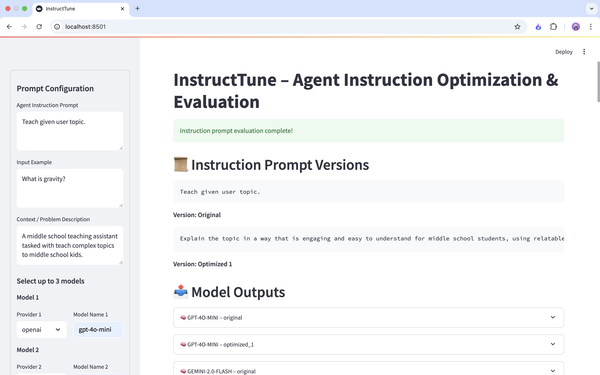
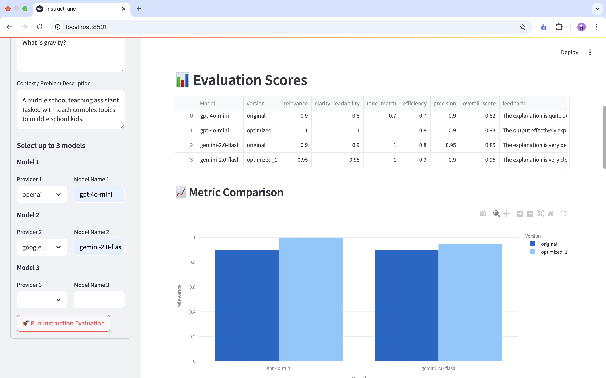
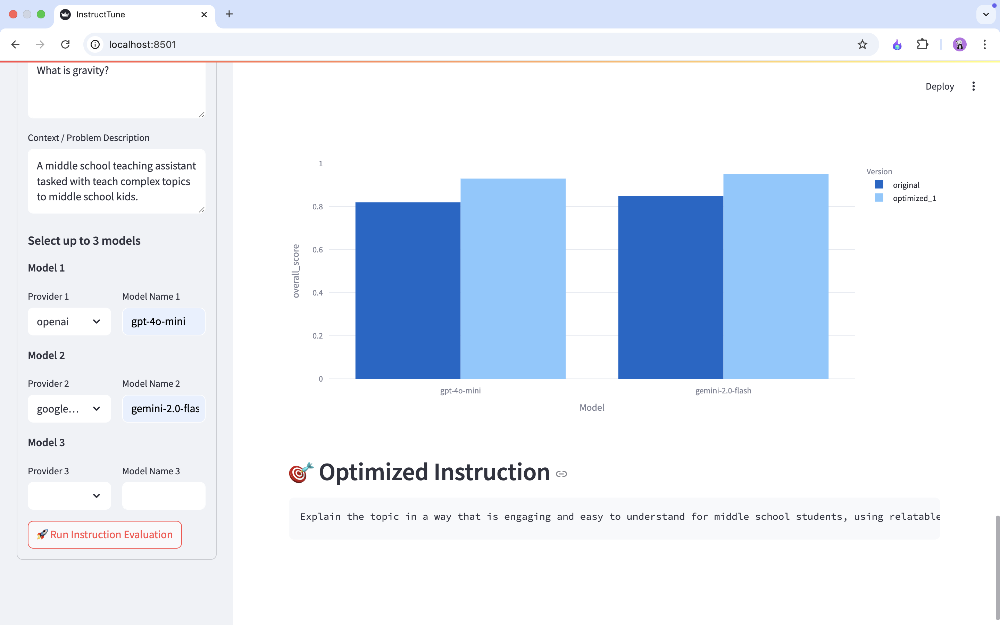

# InstructTune - Agent Instruction Optimization & Evaluation

**InstructTune** is an AI-powered platform for **agent instruction prompt evaluation and optimization**. It allows users to input agent instructions, examples, and task contexts to automatically evaluate and iteratively improve prompt quality using multiple LLMs such as OpenAI’s GPT and Google’s Gemini.

---

## Features

- 🔄 **Agent Instruction Prompt Optimization Workflow**: Automatically refines instruction prompts based on evaluation metrics using a feedback loop.
- 🧠 **Multi-Model Evaluation**: Compare up to 3 models across providers (OpenAI, Google, etc.).
- 📊 **LLM Output Scoring**: Evaluation across key dimensions (relevance, clarity, tone, efficiency, precision).
- 🎯 **Feedback-Guided Prompt Rewriting**: Uses evaluation feedback to enhance prompt effectiveness.
- ⏳ **Latency and Token Usage Tracking**: Monitors performance metrics for each model's response.
- 📈 **Streamlit Dashboard**: Interactive interface to view outputs, scores, and prompt versions.

---

## Tech Stack

- **Frontend**: [Streamlit](https://streamlit.io/)
- **Backend**: [FastAPI](https://fastapi.tiangolo.com/)
- **AI Framework**: [LangGraph](https://langgraph.dev/), [LangChain](https://www.langchain.com/)
- **LLMs**: OpenAI, Google Generative AI
- **Visualization**: Plotly, Pandas
- **Orchestration**: Docker + docker-compose

---

## Setup Instructions

To set up and run the project using Docker Compose:

### 1. Clone the Repository

```bash
git clone https://github.com/your-username/instruct-tune.git
cd instruct-tune
```

### 2. Edit and Rename .env.example
backend/.env.example:
```
OPENAI_API_KEY=your-openai-api-key-here
GOOGLE_API_KEY=your-google-api-key-here
# ... Add other environment variables as needed
```


### 3. Build and Run the Services
```bash
docker-compose up --build
```

This will start the following services:
| Service  | Description                    | Port   |
| -------- | ------------------------------ | ------ |
| frontend | Streamlit interface            | `8501` |
| backend  | FastAPI server (LangGraph API) | `8000` |


### 4. Access the App
After the containers are up, go to:
```http://localhost:8501```

Enter the prompt configuration details and click **Run Instruction Evaluation** to see results and prompt refinements.





